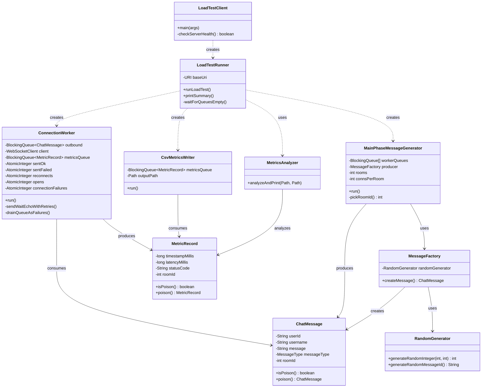
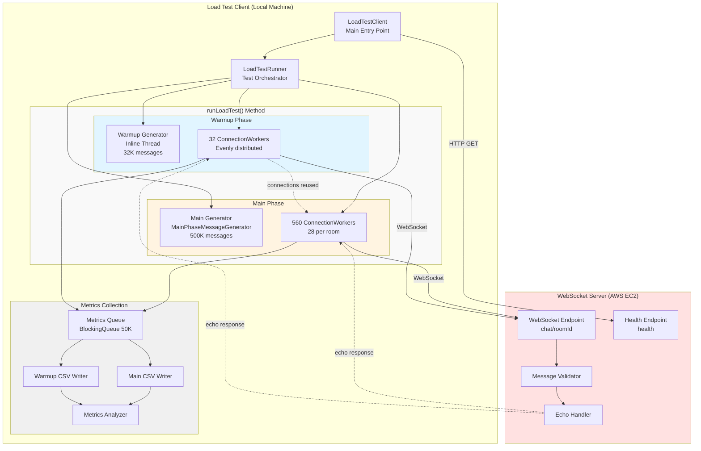
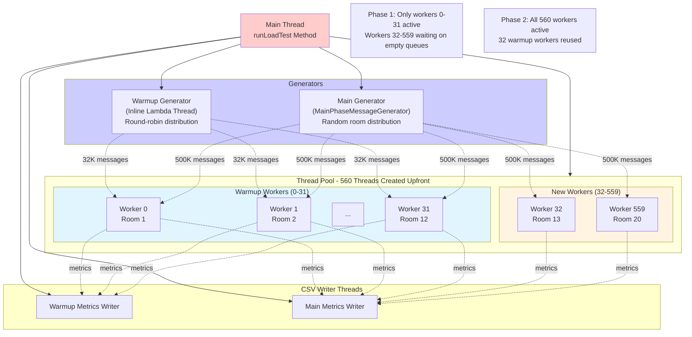
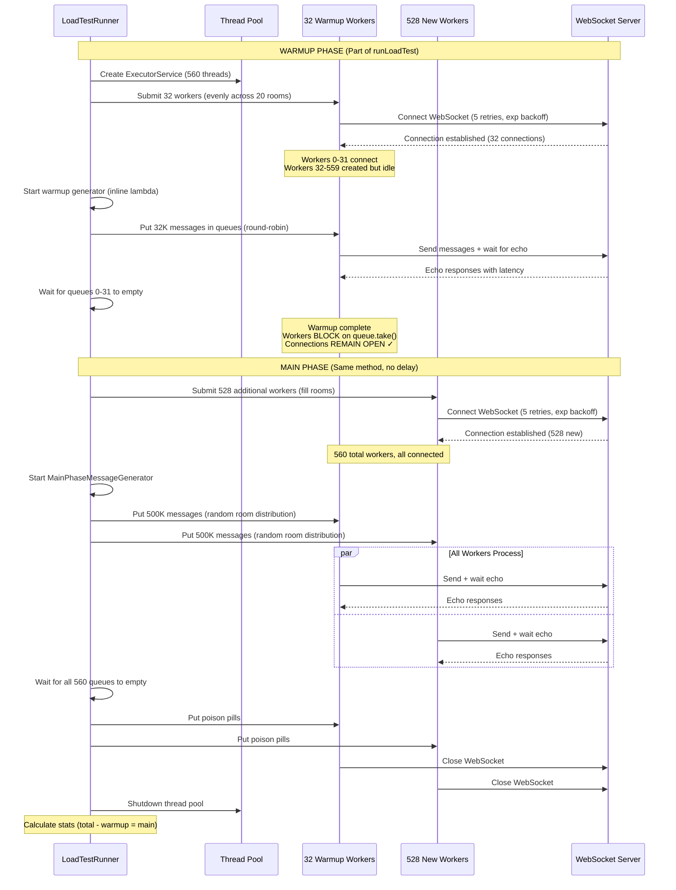
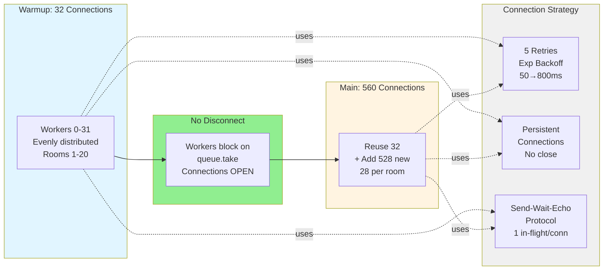

### Class Diagram

```mermaid
classDiagram
    class LoadTestClient {
        +main(args)
        -checkServerHealth() boolean
    }
    
    class LoadTestRunner {
        -URI baseUri
        +runLoadTest()
        +printSummary()
        -waitForQueuesEmpty()
    }
    
    class ConnectionWorker {
        -BlockingQueue~ChatMessage~ outbound
        -WebSocketClient client
        -BlockingQueue~MetricRecord~ metricsQueue
        -AtomicInteger sentOk
        -AtomicInteger sentFailed
        -AtomicInteger reconnects
        -AtomicInteger opens
        -AtomicInteger connectionFailures
        +run()
        -sendWaitEchoWithRetries()
        -drainQueueAsFailures()
    }
    
    class MessageFactory {
        -RandomGenerator randomGenerator
        +createMessage() ChatMessage
    }
    
    class MainPhaseMessageGenerator {
        -BlockingQueue[] workerQueues
        -MessageFactory producer
        -int rooms
        -int connsPerRoom
        +run()
        -pickRoomId() int
    }
    
    class ChatMessage {
        -String userId
        -String username
        -String message
        -MessageType messageType
        -int roomId
        +isPoison() boolean
        +poison() ChatMessage
    }
    
    class MetricRecord {
        -long timestampMillis
        -long latencyMillis
        -String statusCode
        -int roomId
        +isPoison() boolean
        +poison() MetricRecord
    }
    
    class CsvMetricsWriter {
        -BlockingQueue~MetricRecord~ metricsQueue
        -Path outputPath
        +run()
    }
    
    class MetricsAnalyzer {
        +analyzeAndPrint(Path, Path)
    }
    
    
    class RandomGenerator {
        +generateRandomInteger(int, int) int
        +generateRandomMessageId() String
    }
    
    LoadTestClient ..> LoadTestRunner : creates
    LoadTestRunner ..> ConnectionWorker : creates
    LoadTestRunner ..> MainPhaseMessageGenerator : creates
    LoadTestRunner ..> CsvMetricsWriter : creates
    LoadTestRunner ..> MetricsAnalyzer : uses
    
    ConnectionWorker --> ChatMessage : consumes
    ConnectionWorker --> MetricRecord : produces
    
    MainPhaseMessageGenerator --> MessageFactory : uses
    MainPhaseMessageGenerator --> ChatMessage : produces
    
    MessageFactory --> ChatMessage : creates
    MessageFactory --> RandomGenerator : uses
    
    CsvMetricsWriter --> MetricRecord : consumes
    MetricsAnalyzer --> MetricRecord : analyzes
```

### System Architecture Overview

``` mermaid
graph TB
    subgraph Client["Load Test Client (Local Machine)"]
        LTC[LoadTestClient<br/>Main Entry Point]
        LTR[LoadTestRunner<br/>Test Orchestrator]
        
        subgraph SingleMethod["runLoadTest() Method"]
            subgraph WarmupPhase["Warmup Phase"]
                WG[Warmup Generator<br/>Inline Thread<br/>32K messages]
                WW[32 ConnectionWorkers<br/>Evenly distributed]
            end
            
            subgraph MainPhase["Main Phase"]
                MG[Main Generator<br/>MainPhaseMessageGenerator<br/>500K messages]
                MW[560 ConnectionWorkers<br/>28 per room]
            end
        end
        
        subgraph Metrics["Metrics Collection"]
            MQ[Metrics Queue<br/>BlockingQueue 50K]
            WMW[Warmup CSV Writer]
            MMW[Main CSV Writer]
            MA[Metrics Analyzer]
        end
        
        LTC --> LTR
        LTR --> WG
        LTR --> WW
        WW -.connections reused.-> MW
        LTR --> MG
        LTR --> MW
        
        WW --> MQ
        MW --> MQ
        MQ --> WMW
        MQ --> MMW
        WMW --> MA
        MMW --> MA
    end
    
    subgraph Server["WebSocket Server (AWS EC2)"]
        WS[WebSocket Endpoint<br/>chat/roomId]
        VAL[Message Validator]
        ECHO[Echo Handler]
        HEALTH[Health Endpoint<br/>health]
    end
    
    LTC -->|HTTP GET| HEALTH
    WW -->|WebSocket| WS
    MW -->|WebSocket| WS
    WS --> VAL
    VAL --> ECHO
    ECHO -.echo response.-> WW
    ECHO -.echo response.-> MW
    
    style WarmupPhase fill:#e1f5ff
    style MainPhase fill:#fff4e1
    style Metrics fill:#f0f0f0
    style Server fill:#ffe1e1
    style SingleMethod fill:#f9f9f9
```

### Threading Model

```mermaid
graph TB
    MT[Main Thread<br/>runLoadTest Method]
    
    subgraph TP["Thread Pool - 560 Threads Created Upfront"]
        subgraph WarmupWorkers["Warmup Workers (0-31)"]
            W1[Worker 0<br/>Room 1]
            W2[Worker 1<br/>Room 2]
            WD[...]
            W32[Worker 31<br/>Room 12]
        end
        
        subgraph NewWorkers["New Workers (32-559)"]
            W33[Worker 32<br/>Room 13]
            WD[...]
            W560[Worker 559<br/>Room 20]
        end
    end
    
    subgraph Generators
        WG["Warmup Generator<br/>(Inline Lambda Thread)<br/>Round-robin distribution"]
        MG["Main Generator<br/>(MainPhaseMessageGenerator)<br/>Random room distribution"]
    end
    
    subgraph Writers["CSV Writer Threads"]
        WMW[Warmup Metrics Writer]
        MMW[Main Metrics Writer]
    end
    
    MT --> TP
    MT --> WG
    MT --> MG
    MT --> WMW
    MT --> MMW
    
    WG -.32K messages.-> W1
    WG -.32K messages.-> W2
    WG -.32K messages.-> W32
    
    MG -.500K messages.-> W1
    MG -.500K messages.-> W2
    MG -.500K messages.-> W32
    MG -.500K messages.-> W33
    MG -.500K messages.-> W560
    
    W1 & W2 & W32 -.metrics.-> WMW
    W1 & W2 & W32 & W33 & W560 -.metrics.-> MMW
    
    Note1[Phase 1: Only workers 0-31 active<br/>Workers 32-559 waiting on empty queues]
    Note2[Phase 2: All 560 workers active<br/>32 warmup workers reused]
    
    style MT fill:#ffcccc
    style WarmupWorkers fill:#e1f5ff
    style NewWorkers fill:#fff4e1
    style Generators fill:#ccccff
    style Writers fill:#ffffcc
```

### Connection Reuse Sequence Diagram

```mermaid
sequenceDiagram
    participant LTR as LoadTestRunner
    participant Pool as Thread Pool
    participant W32 as 32 Warmup Workers
    participant W528 as 528 New Workers
    participant Server as WebSocket Server
    
    Note over LTR,Server: WARMUP PHASE (Part of runLoadTest)
    
    LTR->>Pool: Create ExecutorService (560 threads)
    LTR->>W32: Submit 32 workers (evenly across 20 rooms)
    W32->>Server: Connect WebSocket (5 retries, exp backoff)
    Server-->>W32: Connection established (32 connections)
    
    Note over W32: Workers 0-31 connect<br/>Workers 32-559 created but idle
    
    LTR->>LTR: Start warmup generator (inline lambda)
    LTR->>W32: Put 32K messages in queues (round-robin)
    
    W32->>Server: Send messages + wait for echo
    Server-->>W32: Echo responses with latency
    
    LTR->>LTR: Wait for queues 0-31 to empty
    
    Note over W32: Warmup complete<br/>Workers BLOCK on queue.take()<br/>Connections REMAIN OPEN ✓
    
    Note over LTR,Server: MAIN PHASE (Same method, no delay)
    
    LTR->>W528: Submit 528 additional workers (fill rooms)
    W528->>Server: Connect WebSocket (5 retries, exp backoff)
    Server-->>W528: Connection established (528 new)
    
    Note over W32,W528: 560 total workers, all connected
    
    LTR->>LTR: Start MainPhaseMessageGenerator
    LTR->>W32: Put 500K messages (random room distribution)
    LTR->>W528: Put 500K messages (random room distribution)
    
    par All Workers Process
        W32->>Server: Send + wait echo
        Server-->>W32: Echo responses
    and
        W528->>Server: Send + wait echo
        Server-->>W528: Echo responses
    end
    
    LTR->>LTR: Wait for all 560 queues to empty
    
    LTR->>W32: Put poison pills
    LTR->>W528: Put poison pills
    
    W32->>Server: Close WebSocket
    W528->>Server: Close WebSocket
    
    LTR->>Pool: Shutdown thread pool
    
    Note over LTR: Calculate stats (total - warmup = main)
```
### WebSocket Connection Management Strategy

``` mermaid
flowchart LR
    subgraph Warmup["Warmup: 32 Connections"]
        W1[Workers 0-31<br/>Evenly distributed<br/>Rooms 1-20]
    end
    
    subgraph Transition["No Disconnect"]
        WAIT[Workers block on<br/>queue.take<br/>Connections OPEN]
    end
    
    subgraph Main["Main: 560 Connections"]
        W2[Reuse 32<br/>+ Add 528 new<br/>28 per room]
    end
    
    subgraph Strategy["Connection Strategy"]
        RETRY[5 Retries<br/>Exp Backoff<br/>50→800ms]
        PERSIST[Persistent<br/>Connections<br/>No close]
        ECHO[Send-Wait-Echo<br/>Protocol<br/>1 in-flight/conn]
    end
    
    W1 --> WAIT
    WAIT --> W2
    
    W1 -.uses.-> RETRY
    W1 -.uses.-> PERSIST
    W1 -.uses.-> ECHO
    
    W2 -.uses.-> RETRY
    W2 -.uses.-> PERSIST
    W2 -.uses.-> ECHO
    
    style Warmup fill:#e1f5ff
    style Transition fill:#90EE90
    style Main fill:#fff4e1
    style Strategy fill:#f0f0f0
```