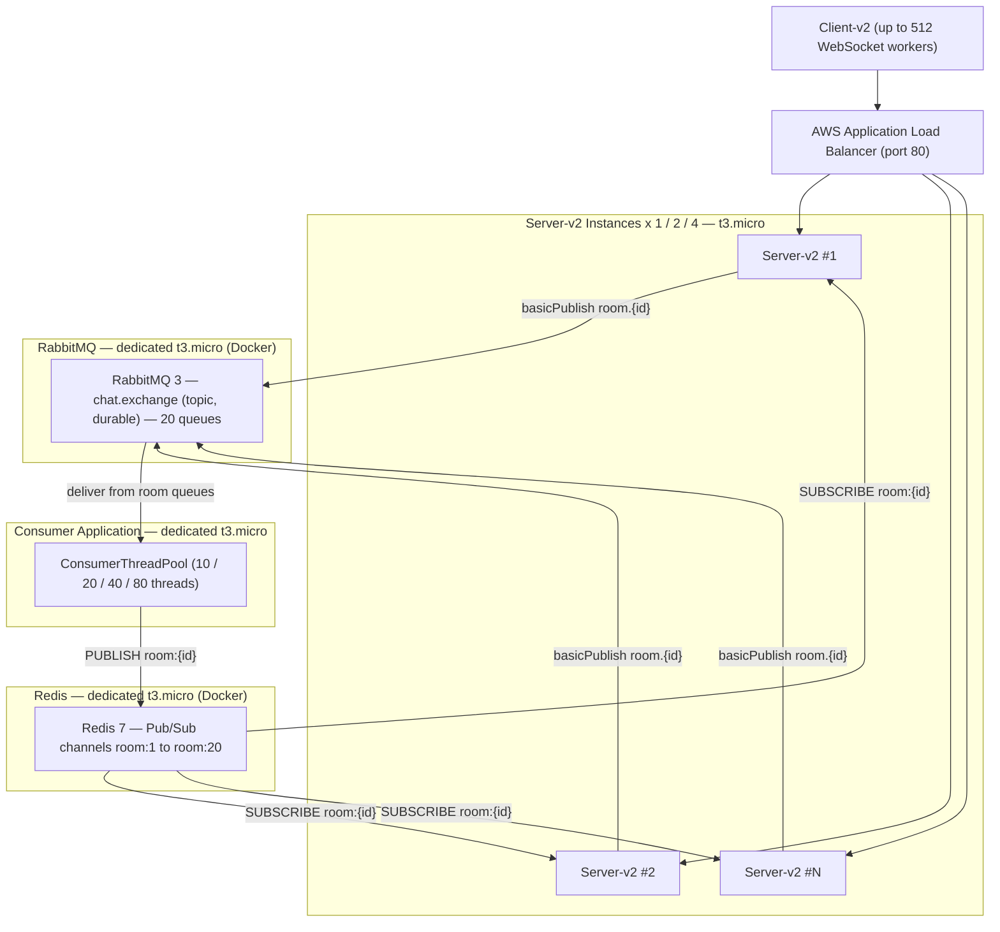
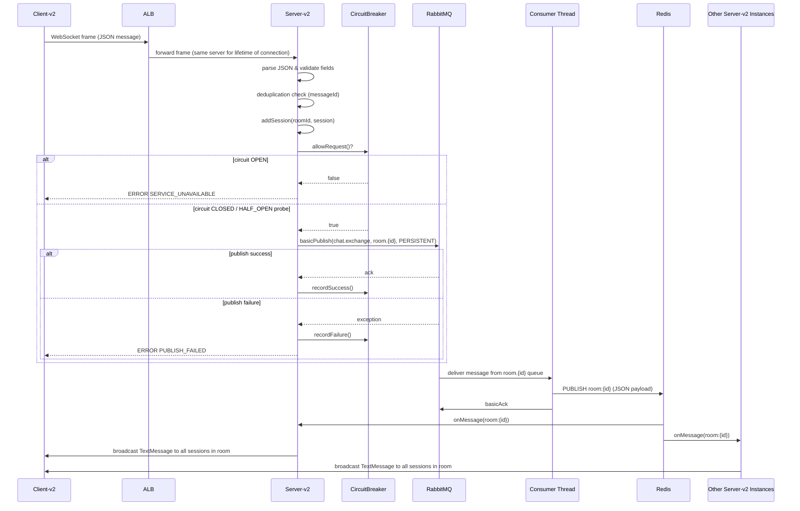
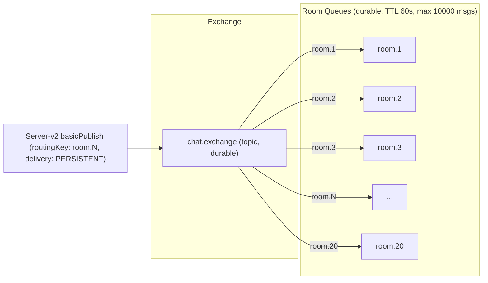
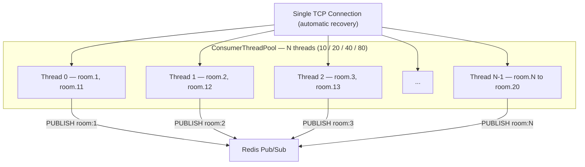
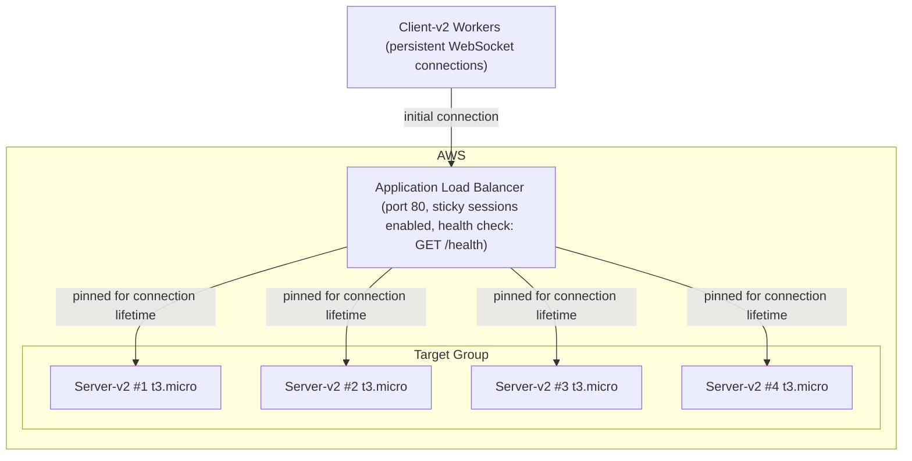
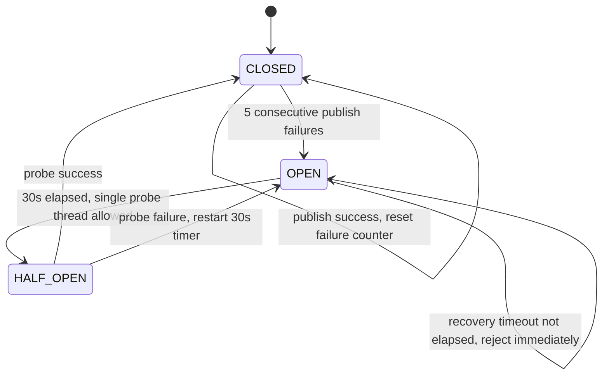
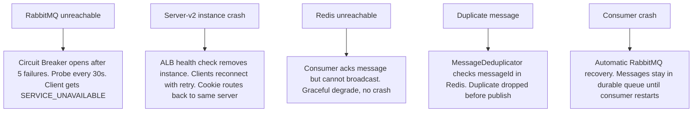

# Architecture Document — ChatFlow CS6650 Assignment 2

---

## 1. System Architecture Diagram

---

## 2. Message Flow Sequence Diagram

---

## 3. Queue Topology Design

**Queue settings per room:**

| Setting | Value |
|---|---|
| Durability | Durable (survives broker restart) |
| x-message-ttl | 60 000 ms |
| x-max-length | 10 000 messages |
| Binding | 1 binding per queue, exact routing key `room.N` |

---

## 4. Consumer Threading Model

**Queue-to-thread assignment (round-robin):**

| Thread count | Rooms per thread | Notes |
|---|---|---|
| 10 | 2 | Sequential processing within each room |
| 20 | 1 | Maximum parallelism, ordering guaranteed per room |
| 40 | Competing (2 threads/room) | Higher throughput, no ordering guarantee |
| 80 | Competing (4 threads/room) | Maximum throughput |

---

## 5. Load Balancing Configuration

**Stickiness design:**

WebSocket connections have two layers of stickiness:

1. **TCP-level (inherent):** Once a WebSocket handshake completes to Server #1, every subsequent frame travels over that same TCP connection — the ALB never re-routes it. This is the primary form of stickiness in this system.

2. **Cookie-based (ALB sticky sessions):** If a worker reconnects after a failure, the ALB sticky session cookie ensures the new connection lands on the same server instance as before, preserving any server-side session state.

**Per-user connection model:** Each `ConnectionWorker` holds one persistent WebSocket connection for the entire test. Multiple users share that connection by sending messages with different `userId` and `roomId` fields. This avoids connection churn while still distributing messages across rooms — the server moves the session to the room specified in each message body, so no reconnection is needed when switching rooms.

---

## 6. Circuit Breaker Pattern

**Parameters (ChatWebSocketHandler.java):**

| Parameter | Value |
|---|---|
| Failure threshold | 5 consecutive failures |
| Recovery timeout | 30 000 ms (30 seconds) |
| Concurrency control | `AtomicReference<State>` + `compareAndSet` — only one thread wins HALF_OPEN probe |
| Client-facing error when OPEN | `SERVICE_UNAVAILABLE` |

---

## 7. Failure Handling Strategies

**Summary table:**

| Failure | Detection | Recovery | Message loss? |
|---|---|---|---|
| RabbitMQ down | publish exception | Circuit breaker, client retries up to 5x | No |
| Server crash | ALB health check fails | Instance removed, clients reconnect | In-flight WS messages lost |
| Redis down | publish exception in consumer | Graceful degrade, message acked not broadcast | Yes — broadcast lost |
| Duplicate message | Redis-backed deduplicator | Silent drop before RabbitMQ publish | N/A |
| Consumer crash | RabbitMQ unacked messages requeued | Auto-recovery, messages redelivered | No — durable queue |
